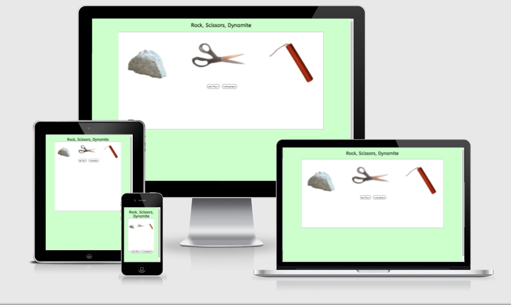

# Rock, Scissors, Dynamite

Rock, Scissors, Paper is a game of chance pitting the user against the computer.  
The game is for anyone who wants to play a game of chance, and especially for anyone who is of the opinion that paper would never defeat a rock.
Live demo [_here_](https://notandy82.github.io/project-portfolio-2/)

## Table of Contents
* [Features](#features)
  * [Existing Features](#existing-features)
  * [Features to Implement](#features-to-implement)
* [Technologies Used](#technologies-used)
* [Testing](#testing)
  * [Bug Fixes](#bug-fixes)
* [Deployment](#deployment)
* [Credits](#credits)
* [Contact](#contact)

## Features

### Existing Features
- Homescreen
  - The game is greeted with a homescreen containing an image of the tools of the game and two buttons in a white area with a light green background.  One button launches the game and the other opens a modal to explain the rules of the game.
- Game area
  - Both the homescreen and game page are contained in a white field on a light green background.
- Button function
  - The buttons for the player's choices are disabled after one click.  Along with providing the input for the player, the button runs the random function for the computer's choice, and both are displayed. There is a 1.5 second pause, after which the result of the round and a button to start the next round are displayed, and the score is updated.
  - The next round button enable the player's buttons.
  - The game ends when either the player or computer reaches 5 wins.  A modal announcing the winner opens, containing a button to take the player back to the homescreen to start over with a reset score.
  - A quit button allows the player to quit the game at any time should it not be going the way they wish. They are taken back to the homescreen and the scores are reset.

### Features to Implement
- The first additional feature to implement would be a two-player version. This could be done by either providing one player's choices at a time, or providing both players the option to make their selections at the same time, but not triggering the result evaluation function until both have done so. Another feature would be to allow for keyboard input for desktop or laptop users. This was included in the original plan for the project but was removed due to time constraints.
- Some additional work to improve the responsiveness of the site on smaller devices should be undertaken.

## Technologies Used
- HTML 5 for the site structure
- CSS for styling
- JavaScript for game functionality
- GitHub for software hosting
- GitPod for development hosting
- Git for version control
- Balsamiq for initial development
- Adobe Photoshop for image manipulation

## Testing
- HTML
  - No warnings or errors were reported when run through the [W3C Validator](https://validator.w3.org/nu/?doc=https%3A%2F%2Fnotandy82.github.io%2Fproject-portfolio-2%2F)
- CSS
  - No warnings or errors were returned when run through the [Jigsaw Validator](https://jigsaw.w3.org/css-validator/validator?uri=https%3A%2F%2Fnotandy82.github.io%2Fproject-portfolio-2%2F&profile=css3svg&usermedium=all&warning=1&vextwarning=&lang=en)
- JavaScript
  - No errors were found when passing through the [Jshint Validator](https://jshint.com/), and the following metrics were returned:
   - There are 26 functions in this file.
   - Function with the largest signature take 0 arguments while the median is 0.
   - Largest function has 10 statements in it while the median is 4.
   - The most complex function has a cyclomatic complexity value of 19 while the median is 1.
### Bug Fixes
- Following the addition and testing of an exit button, it was discovered that while the scores of a new game would be set to zero, further points would be added to the score of the last game which would then be displayed.  Attempts to fix this were unsuccessful, so the scoring system was removed and built again.
- While improving responsiveness of the site for smaller devices, an issue was discovered where the game page would not load.  This was fixed by removing the buttons from a div.

## Deployment
- The site was deployed to GitHub Pages as follows:
  - Open the repository on GitHub
  - Navigate to the settings tab
  - Select Pages in the left-hand menu
  - In source, select main branch and save

## Credits
- Media
  - All photos were taken by Andrew Stanek
- Content
  - Code for scoring adapted from https://sebhastian.com/rock-paper-scissors-javascript/
  - setTimeout function from w3schools
  - Code to hide elements by class from stackoverflow user c.P.u1
- Thanks
  - Thanks to my family for their support and patience
  - Thanks to my mentor Adegbenga Adeye for his guidance

## Contact
Created by Andrew Stanek (notandystanek@gmail.com)